<div align="center">

# 🚀 RepoLens AI
### AI-Powered GitHub Repository Intelligence Platform

<p align="center">
Analyze any public GitHub repository with AI-powered insights, repository health scoring, code quality metrics, security checks, developer productivity analysis, and actionable recommendations.
</p>

<p align="center">


</p>

</div>

---

# 🌟 Overview

RepoLens AI is an intelligent GitHub repository analytics platform that provides deep insights into software projects by analyzing repository structure, commit history, programming languages, contributors, documentation quality, security posture, and overall maintainability.

Unlike basic repository viewers, RepoLens AI evaluates engineering quality, project maturity, developer productivity, and repository health using an advanced scoring engine.

Whether you're a recruiter, software engineer, open-source contributor, or engineering manager, RepoLens AI helps you make data-driven decisions with beautiful dashboards and actionable recommendations.

---

# ✨ Why RepoLens AI?

Traditional GitHub repository viewers only display repository metadata.

RepoLens AI goes much further by analyzing:

- Repository Health
- Code Quality
- Contributor Activity
- Documentation
- Repository Structure
- Project Maturity
- Security Best Practices
- Technology Stack
- Performance Indicators
- Development Trends

---

# 🎯 Key Features

## 📊 Repository Intelligence

- Repository Health Score
- Code Quality Analysis
- Activity Monitoring
- Commit Insights
- Branch Analytics
- Release Tracking
- Issue Monitoring
- Pull Request Metrics
- Contributor Statistics

---

## ⚡ Performance Analytics

- Repository Growth
- Weekly Commits
- Monthly Activity
- Development Velocity
- Project Stability
- Maintenance Score

---

## 🔒 Security Analysis

- License Detection

- Secret Detection

- Git Ignore Validation

- Repository Visibility

- Dependency Health

- Security Recommendations

---

## 🤖 AI Insights

- Project Summary

- Repository Strengths

- Weaknesses

- Improvement Suggestions

- Career Readiness Score

- Open Source Readiness

---

# 📷 Screenshots

## 🏠 Home

```text
screenshots/home.png
```

---

## 📈 Repository Dashboard

```text
screenshots/dashboard.png
```

---

## 📊 Analytics

```text
screenshots/analytics.png
```

---

## 🧠 AI Recommendations

```text
screenshots/recommendations.png
```

---

## 🏆 Final Score

```text
screenshots/final-score.png
```

---

# 🚀 Live Demo

```
https://your-demo-link.vercel.app
```

---

# 🎥 Demo Video

```
https://youtube.com/your-demo
```

---

# 📑 Table of Contents

- Overview
- Features
- Technology Stack
- Architecture
- Installation
- Environment Variables
- Workflow
- Folder Structure
- APIs
- Security
- Roadmap
- Contribution
- License

---

# 🛠 Technology Stack

## Frontend

- React 19
- TypeScript
- Tailwind CSS
- Shadcn UI
- React Router
- Lucide Icons
- Recharts

---

## Backend

- Supabase
- PostgreSQL
- Edge Functions

---

## APIs

- GitHub REST API
- GitHub GraphQL API

---

## Build Tools

- Vite
- ESLint
- PostCSS

---

# 📂 Project Structure

RepoLens-AI

├── public/

├── src/

│ ├── assets/

│ ├── components/

│ ├── pages/

│ ├── hooks/

│ ├── services/

│ ├── lib/

│ ├── utils/

│ ├── types/

│ ├── styles/

│ └── App.tsx

├── supabase/

├── package.json

├── vite.config.ts

├── tsconfig.json

└── README.md

---

# ⚙️ Installation

Clone repository

```bash
git clone https://github.com/Mausam-Kumari9534/RepoLens-AI.git
```

Move inside project

```bash
cd RepoLens-AI
```

Install dependencies

```bash
npm install
```

Run locally

```bash
npm run dev
```

Build Production

```bash
npm run build
```

Preview

```bash
npm run preview
```

---

# 🌍 Environment Variables

Create a `.env` file

```env
VITE_SUPABASE_URL=

VITE_SUPABASE_ANON_KEY=

VITE_GITHUB_API=https://api.github.com
```

---

# 🧩 Core Modules

- Dashboard
- Repository Scanner
- GitHub API Client
- Score Engine
- AI Recommendation Engine
- Analytics Engine
- Charts Engine
- Authentication
- Settings
- Export Reports

---
---

# 🏗️ System Architecture

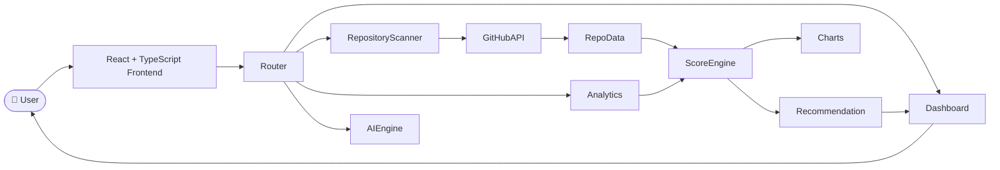

---

# ⚙️ Complete Audit Workflow

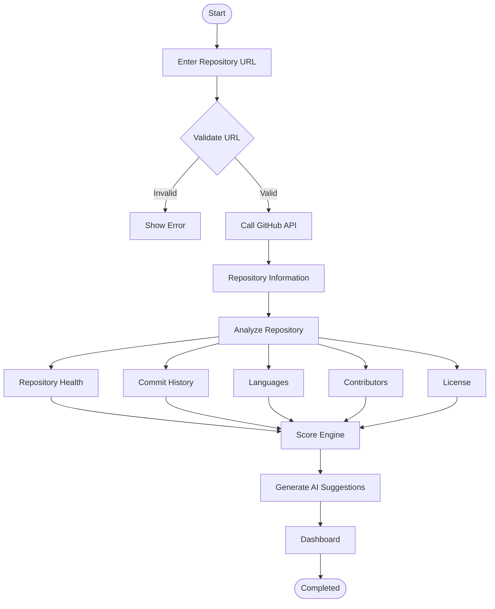

---

# 🔥 GitHub Analysis Engine

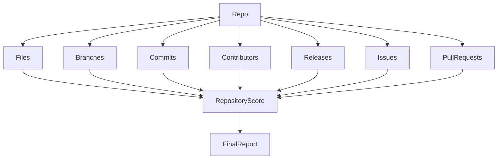

---

# 📈 Score Calculation

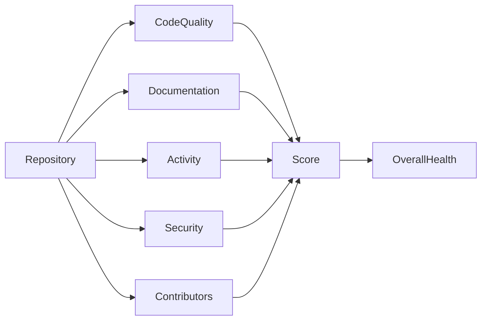

---

# 🌐 GitHub API Workflow

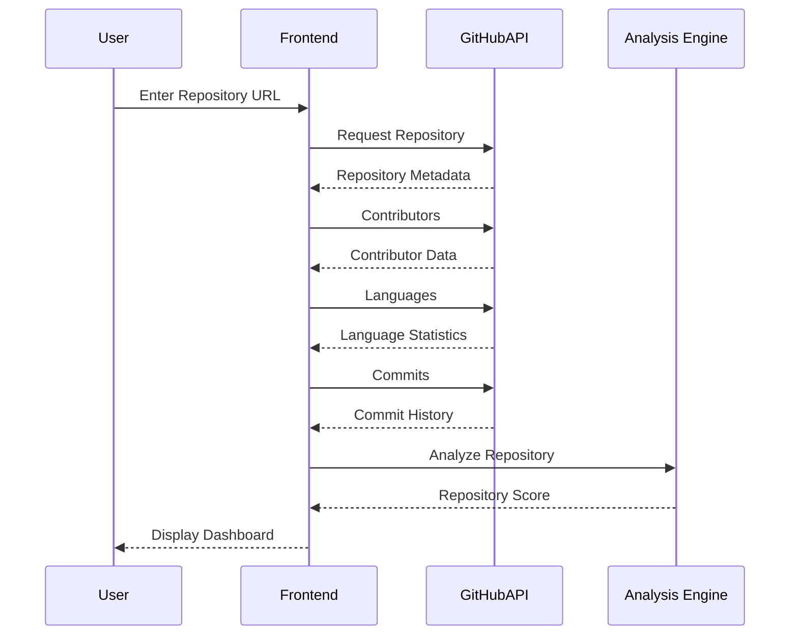

---

# 🧠 AI Recommendation Pipeline

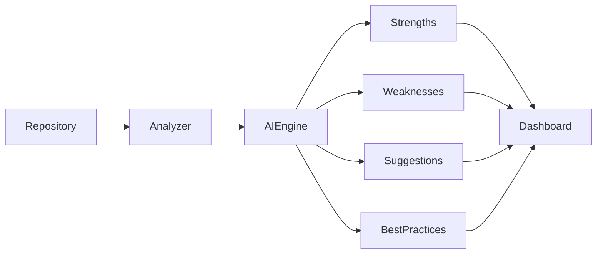

---

# 📊 Dashboard Flow

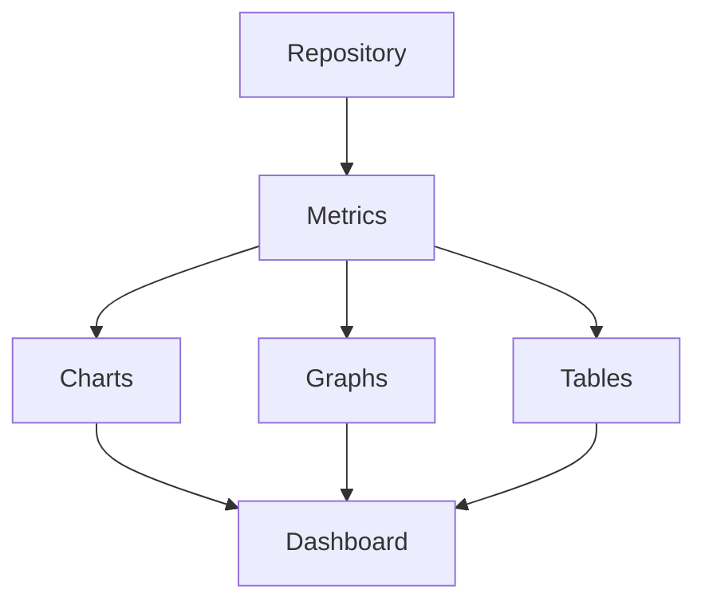

---

# ⚡ Repository Lifecycle

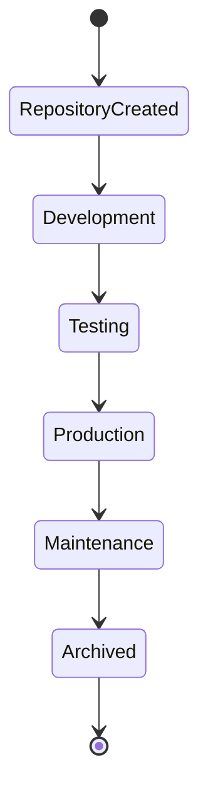

---

# 🧩 Component Architecture

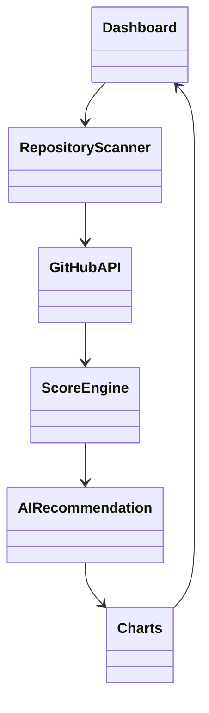

---

# 🔄 Data Flow

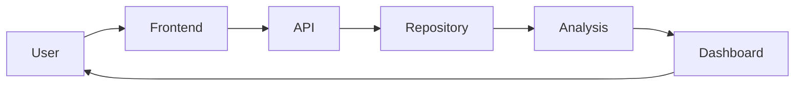

---

# 🖥 ASCII Architecture

```text

                    ┌──────────────────────────┐
                    │          USER            │
                    └────────────┬─────────────┘
                                 │
                                 ▼
                 ┌────────────────────────────────┐
                 │ React + TypeScript Frontend    │
                 └───────────────┬────────────────┘
                                 │
          ┌──────────────────────┼──────────────────────┐
          │                      │                      │
          ▼                      ▼                      ▼
 Repository Scanner         Dashboard             Analytics
          │                      │                      │
          └──────────────┬───────┴──────────────┬───────┘
                         ▼                      ▼
                  GitHub REST API        Score Engine
                         │                      │
                         ▼                      ▼
                Repository Metadata     AI Recommendation
                         │                      │
                         └──────────────┬───────┘
                                        ▼
                               Charts & Reports
                                        │
                                        ▼
                                     Dashboard
                                        │
                                        ▼
                                       USER
```

---

# 📁 Internal Folder Workflow

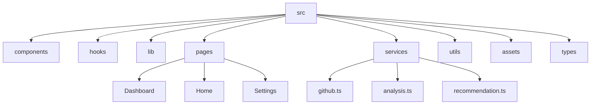

---

# 🎯 Repository Audit Parameters

| Category | Description |
|-----------|-------------|
| ⭐ Stars | Popularity Score |
| 🍴 Forks | Community Adoption |
| 📝 README | Documentation Quality |
| 🔒 License | Open Source Readiness |
| 📦 Releases | Version Stability |
| 👨‍💻 Contributors | Team Collaboration |
| 🔥 Activity | Development Velocity |
| 🐞 Issues | Maintenance |
| 🔀 Pull Requests | Code Review Process |
| 📈 Commits | Development Consistency |

---

---

# 🚀 Deployment Architecture

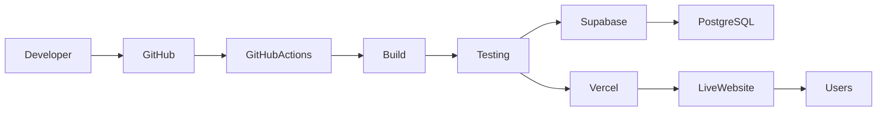

---

# 🔐 Security Architecture

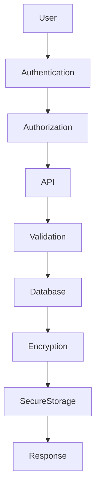

---

# ⚙️ CI/CD Pipeline

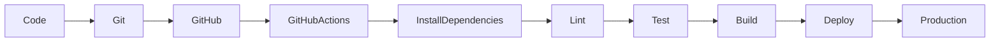

---

# 📡 Request Lifecycle

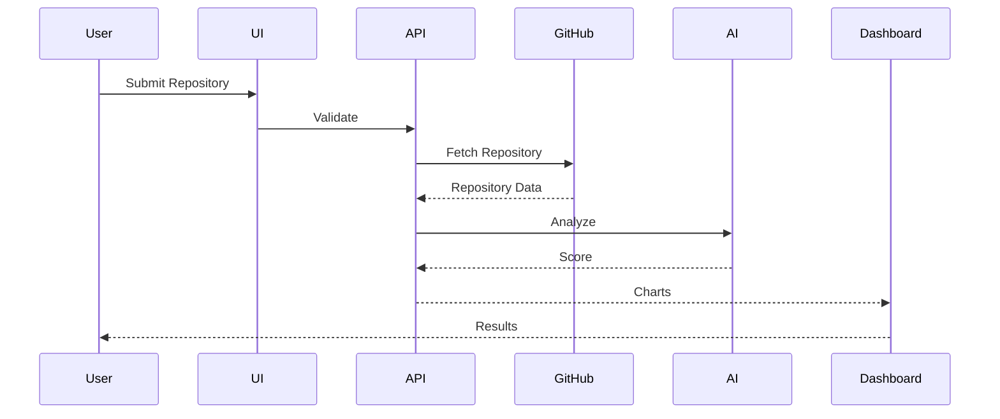

---

# 📊 Repository Analysis Pipeline

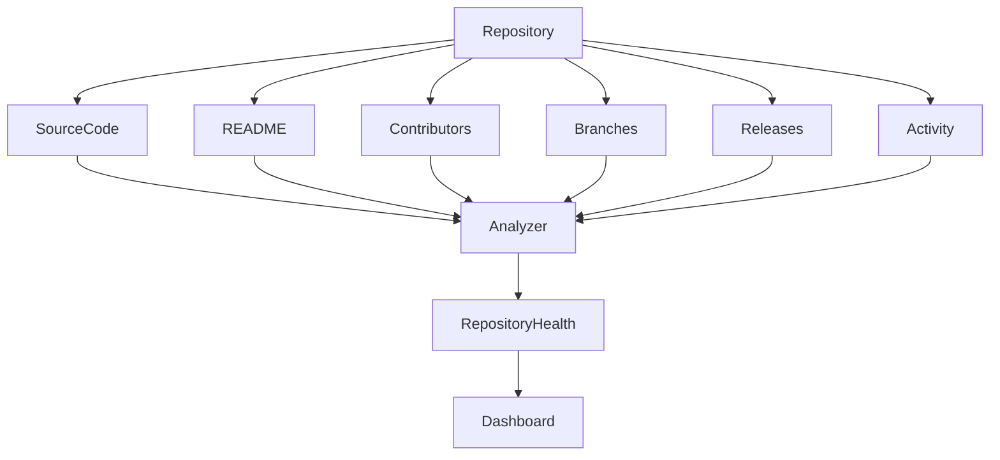

---

# 🧠 AI Analysis Engine

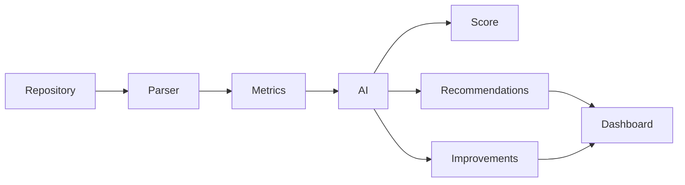

---

# ☁ Cloud Infrastructure

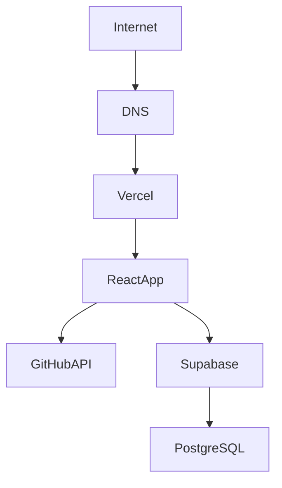

---

# 📈 Project Timeline

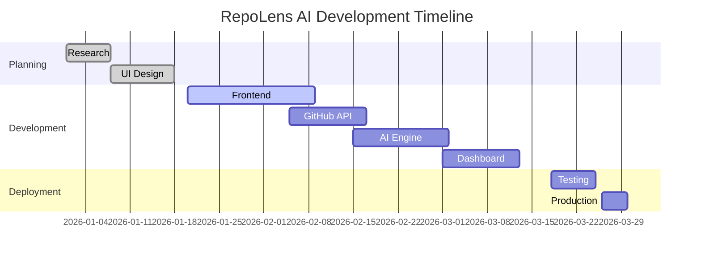

---

# 📊 Project Distribution

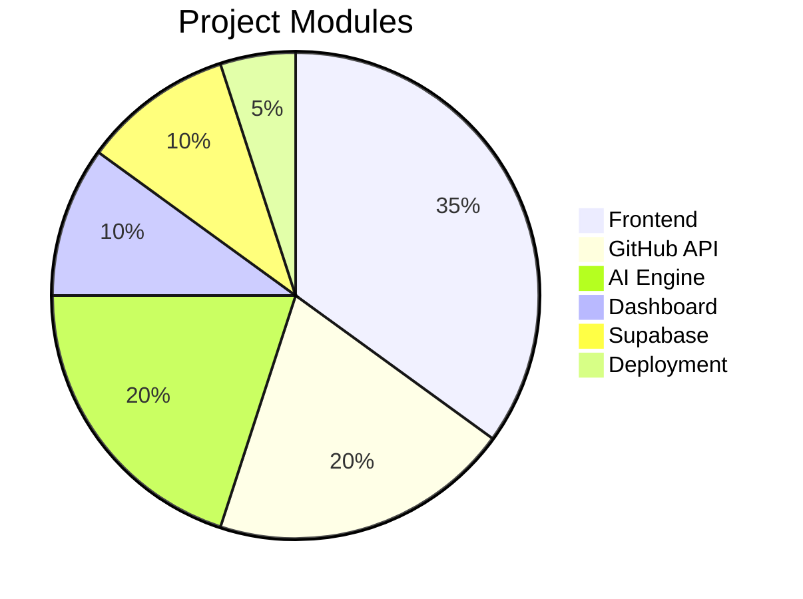

---

# 🚀 User Journey

```mermaid
journey

title RepoLens AI User Journey

section Repository Audit

Open Website :5:User

Paste Repository URL :5:User

Start Analysis :5:User

section Processing

Fetch GitHub Data :5:System

Analyze Repository :5:System

Generate Insights :5:System

section Dashboard

Repository Score :5:User

Charts :5:User

Recommendations :5:User

Export Report :5:User
```

---

# 📊 Repository Health Score

| Category | Weight |
|-----------|-------:|
| Code Quality | 25% |
| Documentation | 15% |
| Repository Activity | 15% |
| Contributors | 10% |
| Issues | 10% |
| Pull Requests | 10% |
| Releases | 10% |
| Security | 5% |
| Community | 5% |
| Overall Score | 100% |

---

# 💻 Supported Technologies

| Category | Technologies |
|------------|----------------------------|
| Frontend | React, TypeScript, Vite |
| UI | Tailwind CSS, shadcn/ui |
| Backend | Supabase |
| Database | PostgreSQL |
| APIs | GitHub REST API |
| Charts | Recharts |
| Icons | Lucide React |
| Authentication | Supabase Auth |
| Deployment | Vercel |
| Package Manager | npm |

---

# 📈 Repository Metrics

✔ Repository Score

✔ Code Quality

✔ Open Source Readiness

✔ Community Score

✔ Contributor Activity

✔ Weekly Commits

✔ Monthly Activity

✔ Branch Analysis

✔ Release History

✔ Repository Size

✔ Technology Detection

✔ Documentation Score

✔ Security Analysis

✔ Repository Popularity

✔ Commit Frequency

✔ Issue Tracking

✔ Pull Request Statistics

✔ License Detection

✔ Maintenance Score

✔ AI Recommendations

---

# 🧩 Major Modules

```

📦 RepoLens AI

┣ 📂 Dashboard

┣ 📂 Repository Scanner

┣ 📂 GitHub API

┣ 📂 AI Engine

┣ 📂 Analytics

┣ 📂 Charts

┣ 📂 Recommendation System

┣ 📂 Authentication

┣ 📂 Settings

┣ 📂 Reports

┗ 📂 Export Engine

```

---

# ⭐ Core Features

- Intelligent GitHub Repository Analysis
- Repository Health Score
- AI Recommendations
- Code Quality Detection
- Documentation Quality
- Commit History Analysis
- Contributor Insights
- Language Statistics
- Branch Analytics
- Release Monitoring
- Open Source Readiness
- Security Best Practices
- Dashboard Analytics
- Export Reports
- Interactive Charts
- Responsive UI
- Dark / Light Theme
- Fast Performance
- Modern Design

---

---

# 🔌 API Documentation

RepoLens AI integrates multiple APIs to generate accurate repository analytics and AI-powered insights.

---

# 🌍 GitHub REST API

## Repository Information

```http
GET /repos/{owner}/{repo}
```

Response

```json
{
  "name":"RepoLens-AI",
  "language":"TypeScript",
  "stars":120,
  "forks":24,
  "watchers":18,
  "issues":12,
  "license":"MIT"
}
```

---

## Contributors

```http
GET /repos/{owner}/{repo}/contributors
```

---

## Languages

```http
GET /repos/{owner}/{repo}/languages
```

---

## Commits

```http
GET /repos/{owner}/{repo}/commits
```

---

## Branches

```http
GET /repos/{owner}/{repo}/branches
```

---

## Pull Requests

```http
GET /repos/{owner}/{repo}/pulls
```

---

## Releases

```http
GET /repos/{owner}/{repo}/releases
```

---

## Issues

```http
GET /repos/{owner}/{repo}/issues
```

---

# 🛢 Supabase Architecture

```mermaid
flowchart LR

Frontend

Frontend --> Auth

Frontend --> Database

Frontend --> Storage

Auth --> PostgreSQL

Database --> PostgreSQL

Storage --> PostgreSQL
```

---

# 🗄 Database Design

```mermaid
erDiagram

USERS ||--o{ REPORTS : creates

USERS ||--o{ ANALYTICS : owns

REPORTS ||--o{ SCORES : contains

REPORTS ||--o{ RECOMMENDATIONS : generates

ANALYTICS ||--o{ CHARTS : displays
```

---

# 📂 Database Tables

## Users

| Column | Type |
|---------|------|
| id | UUID |
| name | TEXT |
| email | TEXT |
| avatar | TEXT |
| created_at | TIMESTAMP |

---

## Reports

| Column | Type |
|---------|------|
| id | UUID |
| repo_name | TEXT |
| owner | TEXT |
| score | INTEGER |
| report | JSON |
| created_at | TIMESTAMP |

---

## Analytics

| Column | Type |
|---------|------|
| id | UUID |
| report_id | UUID |
| commits | INTEGER |
| contributors | INTEGER |
| issues | INTEGER |
| releases | INTEGER |

---

# 🔄 Complete Data Flow

```mermaid
flowchart TD

RepositoryURL

RepositoryURL --> Validator

Validator --> GitHubAPI

GitHubAPI --> Parser

Parser --> Analyzer

Analyzer --> AIEngine

AIEngine --> ReportGenerator

ReportGenerator --> Dashboard

Dashboard --> User
```

---

# 🧠 AI Scoring Engine

```mermaid
graph TD

Repository

Repository --> CodeQuality

Repository --> Documentation

Repository --> Community

Repository --> Security

Repository --> Activity

Repository --> Releases

CodeQuality --> FinalScore

Documentation --> FinalScore

Community --> FinalScore

Security --> FinalScore

Activity --> FinalScore

Releases --> FinalScore
```

---

# 🏆 Repository Score Formula

```text

Repository Score

=

(Code Quality × 25%)

+

(Documentation × 15%)

+

(Activity × 15%)

+

(Security × 15%)

+

(Community × 10%)

+

(Contributors × 10%)

+

(Releases × 10%)

```

---

# ⚡ Performance Optimizations

✔ Lazy Loading

✔ Code Splitting

✔ Dynamic Imports

✔ React Memo

✔ Suspense

✔ Optimized Rendering

✔ API Caching

✔ Error Boundary

✔ Skeleton Loading

✔ Responsive Images

✔ Vite Optimizations

✔ Tree Shaking

✔ Bundle Optimization

✔ TypeScript Strict Mode

---

# 🧩 Folder Explanation

```

src/

├── assets/

Images

Icons

Logos

Fonts

---

components/

Cards

Charts

Navbar

Sidebar

Footer

Buttons

Forms

Loader

---

hooks/

Custom Hooks

GitHub Hooks

Theme Hooks

---

pages/

Home

Dashboard

Analytics

Settings

About

---

services/

GitHub API

AI Engine

Repository Scanner

Recommendation Engine

---

utils/

Formatter

Validator

Helpers

Score Calculator

---

types/

Repository

User

Analytics

API Response

```

---

# 🌐 Environment Variables

```env

VITE_SUPABASE_URL=

VITE_SUPABASE_ANON_KEY=

VITE_GITHUB_TOKEN=

VITE_GITHUB_API=https://api.github.com

VITE_APP_NAME=RepoLens AI

VITE_APP_VERSION=1.0.0

```

---

# 🚀 Running Locally

```bash

git clone https://github.com/Mausam-Kumari9534/RepoLens-AI.git

cd RepoLens-AI

npm install

npm run dev

```

---

# 📦 Production Build

```bash

npm run build

```

---

# 👀 Preview

```bash

npm run preview

```

---

# 🧪 Lint

```bash

npm run lint

```

---

# 📊 Performance Metrics

| Metric | Target |
|---------|---------|
| Lighthouse | 95+ |
| Accessibility | 100 |
| SEO | 100 |
| Best Practices | 100 |
| Performance | 95+ |

---

# 🔐 Security Features

- Environment Variable Protection
- GitHub Token Isolation
- Secure API Calls
- HTTPS Only
- Input Validation
- URL Sanitization
- XSS Protection
- CORS Handling
- Rate Limiting Ready
- Secure Authentication
- Protected Database Access

---
---

# 👩‍💻 Author

<div align="center">

## **Mausam Kumari**

🚀 **Full Stack Developer | DevOps Enthusiast | Open Source Contributor**

Passionate about building scalable full-stack applications, modern DevOps workflows, cloud-native solutions, and AI-powered developer tools. I enjoy creating production-ready software with clean architecture, automation, and exceptional user experience.

<p align="center">
  <a href="https://github.com/Mausam-Kumari9534">
    
  </a>
</p>

⭐ If you found this project useful, consider giving it a **Star** on GitHub!

</div>

---

# ❤️ Acknowledgements

Special thanks to the open-source community and everyone who contributes to making software development better every day.

Built with ❤️ by **Mausam Kumari**

---

<div align="center">

## 🌟 RepoLens AI

**Designed • Developed • Maintained by Mausam Kumari**

© 2026 **Mausam Kumari**. All Rights Reserved.

Made with ❤️ using React, TypeScript, Tailwind CSS, Vite & Supabase.

</div>
